# FairHire AI — Entity-Relationship (ER) Architecture Diagram

> **Phase 2A Architecture Deliverable (Revision Pass)**  
> **Status:** Proposed & Audited (Design Only — Implementation Pending Review)  
> **Engine:** PostgreSQL 16  

---

## 1. Visual Entity-Relationship Diagram

```mermaid
erDiagram
    %% ==========================================
    %% APPLICATION DOMAIN ENTITIES
    %% ==========================================
    USER ||--o{ JOB : "creates"
    USER ||--o{ AUDIT_LOG : "triggers"
    USER ||--o{ CANDIDATE : "links to account"

    JOB ||--o{ JOB_REQUIREMENT : "specifies"
    JOB ||--o{ JOB_SKILL : "requires"
    JOB ||--o{ BIAS_REPORT : "evaluated by"
    JOB ||--o{ MATCH_RESULT : "scored in"

    SKILL ||--o{ JOB_SKILL : "mapped in"
    SKILL ||--o{ RESUME_SKILL : "extracted in"

    CANDIDATE ||--o{ RESUME : "owns"
    CANDIDATE ||--o{ MATCH_RESULT : "traced in"

    RESUME ||--o{ RESUME_SKILL : "contains"
    RESUME ||--|| BLIND_SCREENING_RESULT : "anonymized into"
    RESUME ||--o{ MATCH_RESULT : "scored in"

    BIAS_REPORT ||--o{ REWRITE_SUGGESTION : "generates"

    %% ==========================================
    %% RESEARCH DOMAIN ENTITIES
    %% ==========================================
    DATASET_VERSION ||--o{ DATASET_RECORD : "contains"
    DATASET_VERSION ||--o{ EXPERIMENT_RUN : "evaluates"

    DATASET_RECORD ||--o{ ANNOTATION : "labeled by"
    DATASET_RECORD ||--o{ EXPERIMENT_RESULT : "evaluated in"

    USER ||--o{ EXPERIMENT_RUN : "executes"
    EXPERIMENT_RUN ||--o{ EXPERIMENT_RESULT : "records"
    EXPERIMENT_RUN ||--|| EXPERIMENT_METRIC : "summarized by"

    %% ==========================================
    %% ENTITY ATTRIBUTE DEFINITIONS
    %% ==========================================

    USER {
        bigserial id PK
        varchar email UK "User login email"
        varchar password_hash "Bcrypt hash"
        varchar name "Full name"
        varchar role "RECRUITER, CANDIDATE, ADMIN"
        varchar status "ACTIVE, INACTIVE"
        timestamptz created_at
        timestamptz updated_at
    }

    JOB {
        bigserial id PK
        bigint creator_id FK "References USER(id)"
        varchar title "Job requisition title"
        varchar department "Department or team"
        text raw_description "Original JD text"
        text rewritten_description "Sanitized inclusive JD"
        varchar status "DRAFT, ACTIVE, CLOSED, ARCHIVED"
        timestamptz created_at
        timestamptz updated_at
    }

    JOB_REQUIREMENT {
        bigserial id PK
        bigint job_id FK "References JOB(id)"
        varchar requirement_type "EXPERIENCE_YEARS, EDUCATION, CERT"
        varchar requirement_value "Broad qualitative descriptor"
        varchar necessity "REQUIRED, PREFERRED"
        numeric weight "Recruiter weighting"
    }

    SKILL {
        bigserial id PK
        varchar name UK "Unique skill name"
        varchar category "LANGUAGES, CLOUD, ML"
        text_array synonyms "Array of aliases"
        timestamptz created_at
    }

    JOB_SKILL {
        bigserial id PK
        bigint job_id FK "References JOB(id)"
        bigint skill_id FK "References SKILL(id)"
        boolean is_mandatory "Hard filter gate"
        integer minimum_years "Min experience required"
        numeric weight "Weight in ATS score"
    }

    CANDIDATE {
        bigserial id PK
        bigint user_id FK "Nullable link to USER(id)"
        varchar full_name "Candidate legal name"
        varchar email UK "Contact email"
        varchar phone "Phone number"
        timestamptz created_at
        timestamptz updated_at
    }

    RESUME {
        bigserial id PK
        bigint candidate_id FK "References CANDIDATE(id)"
        varchar file_path "Storage path / URI"
        varchar file_name "Original upload name"
        varchar file_type "PDF, DOCX, TXT"
        char file_hash_sha256 "SHA-256 integrity hash"
        text raw_text "Parsed raw text"
        numeric parsed_years_experience "Extracted years"
        text parsed_education "Extracted degrees"
        varchar parsing_status "PENDING, COMPLETED, FAILED"
        timestamptz created_at
        timestamptz updated_at
    }

    RESUME_SKILL {
        bigserial id PK
        bigint resume_id FK "References RESUME(id)"
        bigint skill_id FK "References SKILL(id)"
        numeric extraction_confidence "0.000 to 1.000"
        varchar context_snippet "Surrounding resume sentence"
    }

    BLIND_SCREENING_RESULT {
        bigserial id PK
        bigint resume_id FK "Unique FK to RESUME(id)"
        text anonymized_text "Sanitized resume text"
        integer redactions_count "Total redactions applied"
        jsonb redactions_log "List of replacements"
        varchar anonymization_ruleset_version "Ruleset version tag"
        timestamptz created_at
    }

    BIAS_REPORT {
        bigserial id PK
        bigint job_id FK "References JOB(id)"
        varchar target_version "ORIGINAL, REWRITTEN"
        numeric gender_bias_score "0.0000 to 1.0000"
        varchar gender_lean "BALANCED, MASCULINE, FEMININE"
        numeric age_bias_score "0.0000 to 1.0000"
        numeric flesch_reading_ease "Flesch readability score"
        varchar reading_level "EASY, MODERATE, DIFFICULT"
        integer total_flagged_terms "Count of flags"
        integer masculine_terms_count
        integer feminine_terms_count
        integer age_terms_count
        timestamptz created_at
    }

    REWRITE_SUGGESTION {
        bigserial id PK
        bigint bias_report_id FK "References BIAS_REPORT(id)"
        varchar original_phrase "Flagged term"
        varchar suggested_replacement "Inclusive swap"
        varchar category "GENDER, AGE, READABILITY"
        varchar context_snippet "Context sentence"
        boolean is_accepted "Accepted by recruiter"
        timestamptz created_at
    }

    MATCH_RESULT {
        bigserial id PK
        bigint job_id FK "References JOB(id)"
        bigint candidate_id FK "References CANDIDATE(id)"
        bigint resume_id FK "References RESUME(id)"
        varchar screening_mode "NORMAL, BLIND"
        varchar matching_method "KEYWORD, SEMANTIC, HYBRID"
        numeric keyword_score "Lexical overlap"
        numeric skill_jaccard_score "Skill Jaccard"
        numeric semantic_score "S-BERT cosine sim"
        numeric keyword_weight "w_kw (default 0.3)"
        numeric semantic_weight "w_sem (default 0.7)"
        numeric final_composite_score "Composite match score"
        integer rank_in_pool "Rank among applicants"
        integer matched_skills_count
        integer missing_skills_count
        jsonb missing_skills "Missing required skills"
        varchar model_version "all-MiniLM-L6-v2"
        timestamptz created_at
    }

    AUDIT_LOG {
        bigserial id PK
        bigint user_id FK "Actor"
        varchar action "AUDIT ACTION"
        varchar entity_type "JOB, RESUME, MATCH"
        bigint entity_id "Target ID"
        jsonb details "Context payload"
        varchar ip_address "Client IP"
        timestamptz created_at
    }

    DATASET_VERSION {
        bigserial id PK
        varchar version_tag UK "e.g. v1.0.0"
        varchar name "Dataset title"
        text description "Benchmark details"
        char checksum_sha256 "SHA-256 archive hash"
        integer total_resumes_count
        integer total_jds_count
        varchar lifecycle_status "DRAFT, VALIDATED, FROZEN, DEPRECATED"
        timestamptz frozen_at "Timestamp of freeze"
        timestamptz created_at
    }

    DATASET_RECORD {
        bigserial id PK
        bigint dataset_version_id FK "References DATASET_VERSION(id)"
        varchar record_identifier "e.g. PAIR-00142"
        varchar jd_title
        text jd_text
        text_array jd_required_skills
        varchar candidate_identifier "e.g. BENCH-CAND-0089"
        text candidate_raw_resume
        text candidate_anonymized_resume
        text_array candidate_skills
        jsonb demographic_ground_truth "Explicitly sourced research labels only"
        timestamptz created_at
    }

    ANNOTATION {
        bigserial id PK
        bigint dataset_record_id FK "References DATASET_RECORD(id)"
        varchar annotator_id "Expert ID"
        integer relevance_score "0 to 3 scale"
        boolean is_match "Hire threshold"
        jsonb exclusionary_phrases_labeled
        numeric confidence "Annotator confidence"
        text notes
        timestamptz created_at
    }

    EXPERIMENT_RUN {
        uuid id PK "gen_random_uuid()"
        varchar run_name "Run title"
        bigint dataset_version_id FK "References DATASET_VERSION(id)"
        bigint executor_id FK "References USER(id)"
        varchar method "KEYWORD, SEMANTIC, HYBRID, BLIND"
        varchar embedding_model "all-MiniLM-L6-v2"
        varchar model_version "1.0.0"
        varchar preprocessing_version "v1.0-standard"
        varchar anonymization_version "v1.0-ruleset"
        varchar git_commit_hash "Commit hash"
        jsonb hyperparameters "Weights, top_k, metric"
        varchar status "STARTED, COMPLETED, FAILED"
        timestamptz started_at
        timestamptz completed_at
        bigint duration_ms
        text error_message
    }

    EXPERIMENT_RESULT {
        bigserial id PK
        uuid experiment_run_id FK "References EXPERIMENT_RUN(id)"
        bigint dataset_record_id FK "References DATASET_RECORD(id)"
        numeric normal_score
        numeric blind_score
        integer normal_rank
        integer blind_rank
        integer rank_change "STORED generated abs diff"
        integer ground_truth_relevance
        timestamptz created_at
    }

    EXPERIMENT_METRIC {
        bigserial id PK
        uuid experiment_run_id FK "Unique FK to EXPERIMENT_RUN(id)"
        numeric spearman_rho "Spearman rank correlation"
        numeric mean_rank_shift "Average rank delta"
        integer candidates_with_rank_change_count
        numeric precision_at_k "Precision@K"
        numeric recall_at_k "Recall@K"
        numeric ndcg_at_k "NDCG@K"
        numeric f1_score "F1 Score"
        numeric jd_bias_score_before
        numeric jd_bias_score_after
        numeric bias_reduction_delta
        numeric eval_latency_avg_ms
        timestamptz created_at
    }
```

---

## 2. Key Architecture Principles Highlighted in Diagram

1. **Explicit Operational Traceability**:
   - `MATCH_RESULT` holds a 3-way relation to `JOB`, `CANDIDATE`, and `RESUME`, enabling complete auditability for recruiters without ambiguous indirection.
2. **Clear Separation of Qualifications vs. Normalized Skills**:
   - `JOB_REQUIREMENT` captures high-level qualitative criteria (e.g., minimum degree, years of experience, work authorizations).
   - `JOB_SKILL` links explicitly to the normalized `SKILL` taxonomy, providing machine-actionable tokens for vector and keyword engines.
3. **Research Dataset Lifecycle**:
   - `DATASET_VERSION` incorporates a formal `lifecycle_status` (`DRAFT`, `VALIDATED`, `FROZEN`, `DEPRECATED`), ensuring experiments execute only against frozen, cryptographically verified benchmark snapshots.
4. **Reproducibility Metadata**:
   - `EXPERIMENT_RUN` captures the complete configuration tuple: `dataset_version_id`, `model_version`, `preprocessing_version`, `anonymization_version`, `git_commit_hash`, and hyperparameter payload.
